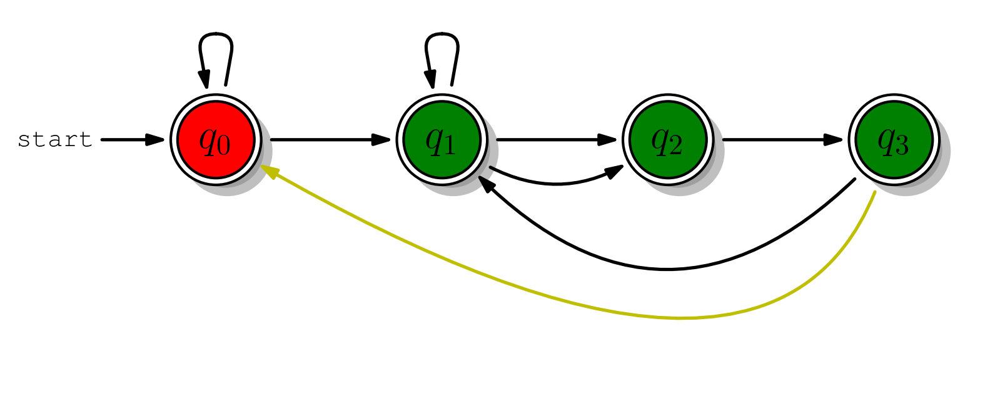

# digraph-plot

This is an ongoing project. The goal is to use matplotlib to draw beautiful finite state machine images. Currently, text labels still need to be manually positioned by the user (because I haven't found a suitable method for calculating the midpoint of a path yet).

Example:

